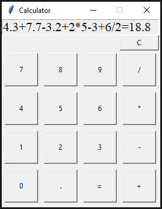
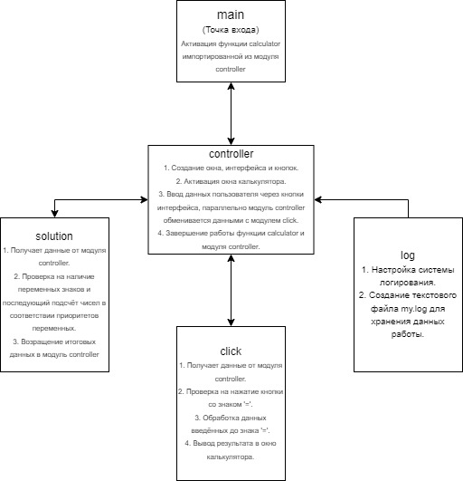
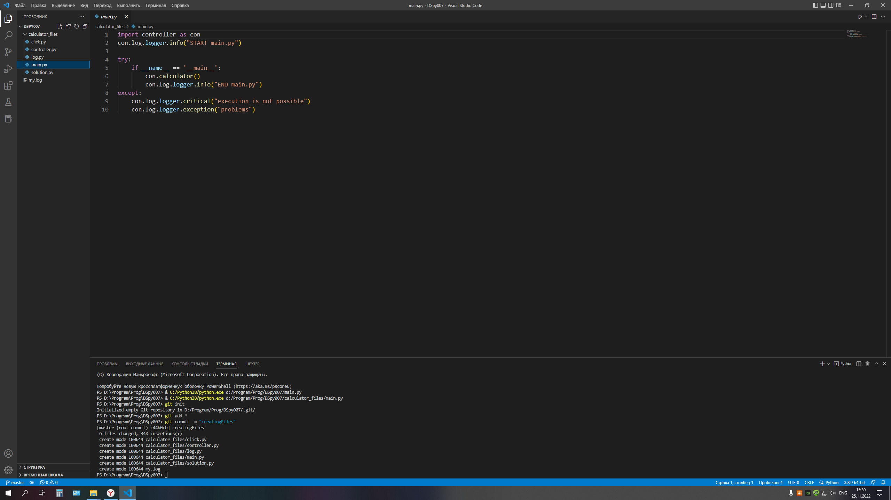
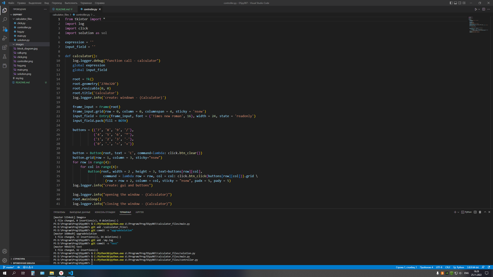
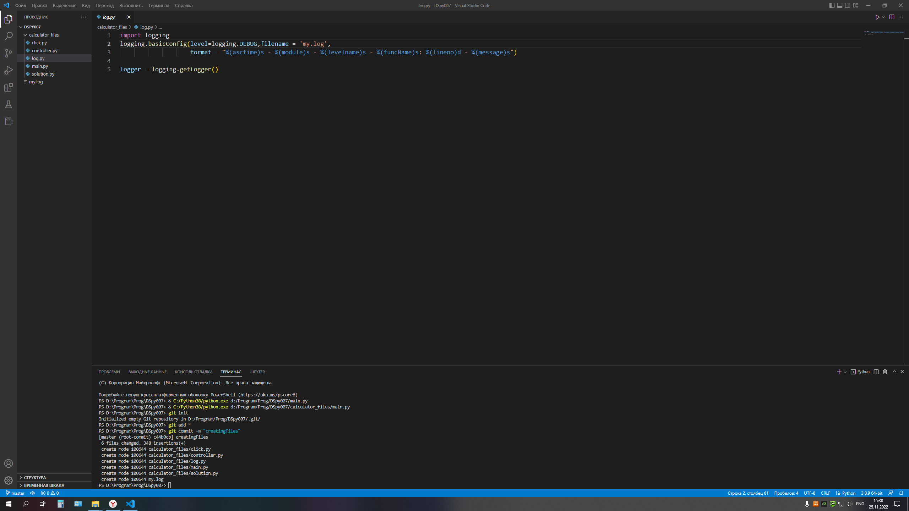
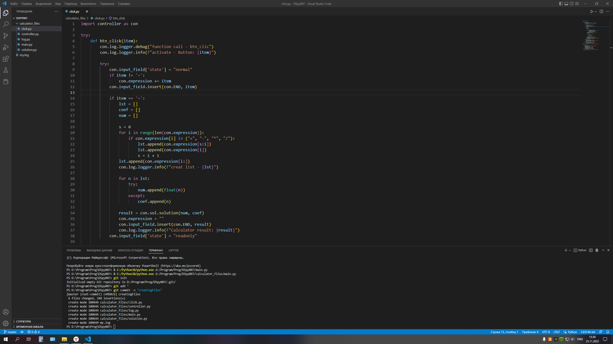
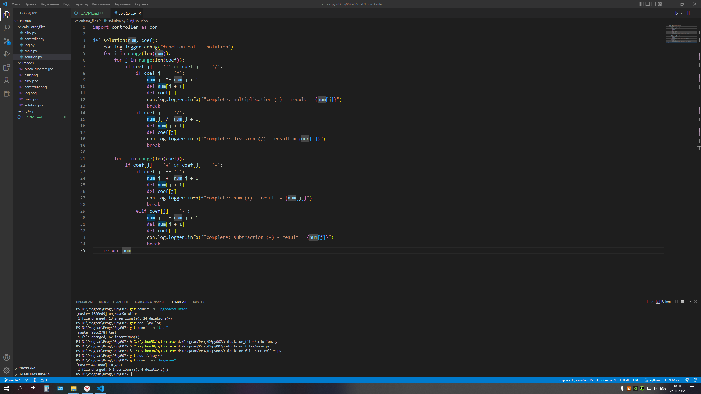

# Калькулятор с графическим интерфейсом

## Описание:
>Данное приложение представляет из себя простой калькулятор с использованием графического интерфейса Tkinter. Все исполняемые файлы находятся в папке calculator_files. Данные работы калькулятора хранятся в текстовом файле my.log

Над данным приложением работал Смирнов Н.Г.

## Архитектура приложения:

### Блок-схема работы модулей

## 1. Модуль - main

### main - является точкой входа, с которой начинается запуск приложения, через импортированные данные модуля (controller).

## 2. Модуль - controller

### controller - сердце программы куда импортируются данные всех нижеперечисленных модулей (log, click, solution) + tkinter для решения функции calculator и видения журнала логирования.

### A) Создаются две глобальные переменные expression (хранит данные введённые пользователем) и input_field (хранит настройки для поля ввода и вывода). Их данные будут использоваться в модуле click.
### B) Создание и настройка окна калькулятора + поле ввода и вывода.
### С) Создание и настройка кнопок для ввода или очистки поля ввода и вывода калькулятора. 
### D) Открытие окна калькулятор. Ввод данных пользователем, через нажатие кнопок интерфейса калькулятора (до закрытия окна калькулятора пользователем).

## 3. Модуль - log

### log - модуль необходимый для видения журнала логов (от выполненных функций и алгоритмов до ошибок в коде приложения).
### Настройка логера:

* Место и название файла, где будут хранится данные, собранные со всех рабочих модулей.
* Формат логирования.
* Объявление переменной logger через которую будет проводится логирование.

### Настроенный модуль log импортируется в controller для последующего использования во всех остальных модулях.

## 4. Модуль - click

### click - распознаватель нажатых кнопок обменивающийся данными с модулем controller.

* Функция btn_click - данные что ввёл пользователь сохраняются в глобальную переменную expression. Если последняя  нажатая кнопка является знаком '=', то переменная expression разбивается на списки (без знака '='), которые обращается к модулю solution импортированному в controller для решения полученного выражения и вывода результата в окне интерфейса.
* Функция btn_clear - при нажатии на кнопку со знаком 'C' удаляет данные из глобальной переменной expression и очищает поле ввода и вывода (в интерфейсе калькулятора).

## 5. Модуль - solution

### solution - получает запрос на выполнения функции solution от модуля click через модуль controller. Функция перебирает полученные списки из знаков и чисел постепенно выполняя условия выражения в рамках приоритетов переменных, а также сокращая списки до тех пор, пока числа в списке не будут равны одному единственному числу. Полученный результат функция вернёт в модуль click как результат выражения (result).